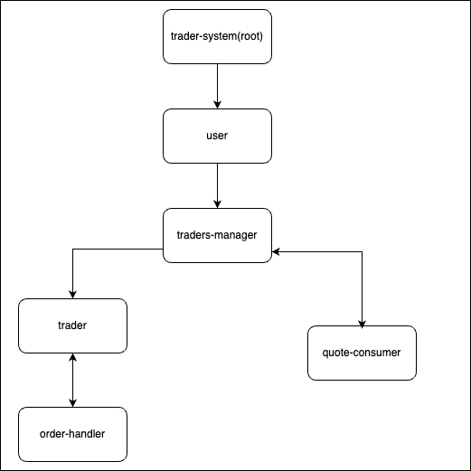

Hello, This project is a basic implementation for the below requirement using Akka framework, Spring boot, and Mongodb

# Quick Start

To run the applications execute the below command on the root folder

`docker-compose up`

# Requirments 

Build a financial app using Akka,
It’s going to be a fake financial app, where we will be making (virtual) money. The application is composed of a set of components. Quote generator, traders and the auditor.
Each component is responsible for doing its job as the following:
- The quote generator - this is an absolutely unrealistic simulator that generates the quotes for 5 fictional companies. The market data is published on to a Kafka topic. Traders consume those data to know the current price.
- The traders - these are a set of components that receives quotes from the quote generator and decides whether or not to buy or sell a particular share. To make this decision, they rely on their current amount of money💰💰💰
- The audit -We need to keep a list of all our operations . The audit component receives operations from the Traders and address  It then stores theses in a database.
- The traders should have different criteria to buy and sell suggested by you, and you should show what was the best criteria for making money.

# Architecture Overview 

This project contains 3 microservices which interact with each other 

## 1-Quote Generator 

this microservice is responsible for generating completely random data for 5 companies. 

it will run using a scheduler every second to generate 5 quotes and produce them to Kafka topic.

This service is built using Akka framework

## 2-Traders 

This service will consume from the same kafka topic and decide to either buy, sell, or skip.

the following digram shows the relation between actors inside the application.

- **trader-system**: is the actor system (root actor)

- **user**: is the root actor for all user-created actors

- **traders-manager**: this actor will be responsible for managing the queue-consumer actor and multiple trader actors, and broadcasting the message received from the queue consumer to all the traders.
  
- **quote-consumer**: this actor will be listening on the kafka topic and waiting for quotes, for each consumed message it will be sent back to the traders-manager to share it with all traders.
  
- **trader**: The trader actor's responsibility is to react to the provided quote with either sell, buy, or skip and to send it order-handler if it is sell or buy.
  
- **order-handler**: this actor's responsibility is to send the order to Auditor-svc using REST API to save the order. in case of failure, it will emit a refund message to the sender trader.

This service is built using Akka framework

## 3- Auditor-svc

This service will have one exposed REST API /orders which will take an order and save it to the database (Mongodb)

This service is built using Spring boot framework

# Not implemented business

the above application doesn't implement all the required business provided on the requirements. 

For example, the buy and sell is completely random for all trader actors and there is no validation on the buy and sell operations other than the amount is sufficient to buy (in a real-life scenario each trader should buy some shares to be able to sell it). Also, the traders will be regenerated with every restart, and their state will not persist.

I believe this project is a start for me to continue exploring Akka framework
